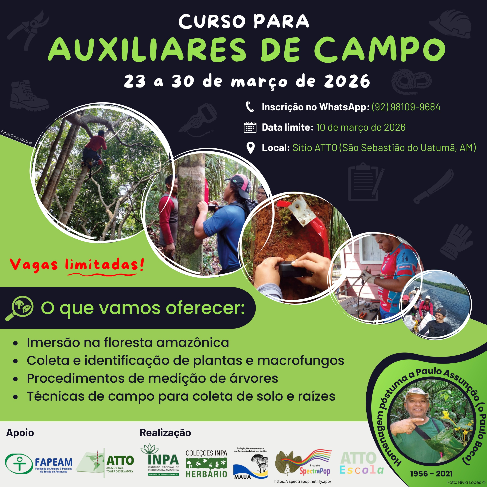
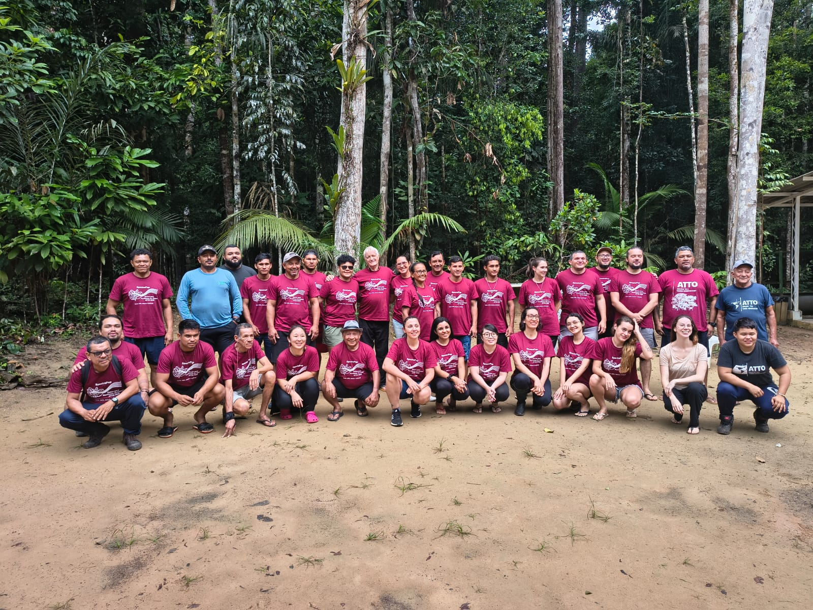

# Apresentação

O curso foi desenvolvido no âmbito do [Projeto SpectraPop](/index.html),
com o objetivo de capacitar auxiliares de campo para atuação em
pesquisas científicas na Amazônia, com foco em práticas seguras,
organização de dados e coleta botânica. Realizado no sítio ATTO (Amazon
Tall Tower Observatory), o curso integrou teoria e prática em ambiente
real de floresta, proporcionando aos participantes uma experiência
imersiva nas rotinas de campo.

<figure style="text-align:center;">

{.slide style="display:block;"}

<figcaption style="font-size:0.9rem; color:#555; margin-top:6px;">

Flyer de divulgação do curso para formação de Auxiliares de Campo do
Projeto SpectraPop.

</figcaption>

</figure>

# Detalhes do curso

**Onde:** Sítio ATTO – Amazon Tall Tower Observatory, Reserva de
Desenvolvimento Sustentável do Uatumã, São Sebastião do Uatumã,
Amazonas.

```{r echo=FALSE, message=FALSE, warning=FALSE}
library(leaflet)
leaflet() %>%
  addTiles %>% # Add default OpenStreetMap map tiles
  setView(lng = -59.003481, lat = -2.148550, zoom = 14)
```

**Data:** De 23 a 30 de março de 2026.\

**Público-alvo:** Auxiliares de campo já atuantes na área e técnicos
interessados em atuar como auxiliares de campo em pesquisas científicas
na Amazônia, especialmente nas áreas de botânica, ecologia e coleta de
dados ambientais.\

**Número de vagas ofertadas:** 20 vagas.\

**Carga horária:** 66h (com emissão de certificado de participação).\

**Formato:** Presencial, com atividades teóricas e práticas realizadas
em ambiente de floresta. O curso foi estruturado em regime intensivo,
com rotinas diárias de campo, atividades práticas supervisionadas e
aulas expositivas no período noturno.

**Material:** Foram utilizados equipamentos de campo, materiais para
coleta botânica, ferramentas de escalada, instrumentos para coleta de
solo e insumos para preservação de amostras. As orientações foram
fornecidas diretamente durante as atividades práticas.

# Cronograma

## Visão geral

-   Os participantes receberam orientações sobre segurança em campo,
    incluindo deslocamento em trilhas, uso de equipamentos e conduta em
    ambiente de floresta.
-   Foram abordados princípios de ética na coleta de material biológico,
    respeitando normas científicas e ambientais.
-   As atividades incluíram rotina intensa de campo, exigindo preparo
    físico e adaptação às condições amazônicas.

## Linha do tempo

Veja a programação completa:

<iframe src="docs/cronograma.pdf" width="100%" height="600px">

</iframe>

# Equipe

## Comissão organizadora

 Dra. Flávia
Machado Durgante (MAUA/ATTO/INPA) <a href="xxx" target="_blank"></a>

 Dra. Samyra
Ramos Chaves (MAUA/INPA) <a href="xxx" target="_blank"></a> 

 Dra. Caroline da Cruz Vasconcelos
(MAUA/INPA) <a href="xxx" target="_blank"></a>

 Me. Kaio
Cesar Marinho da Cunha (MAUA/INPA) <a href="xxx" target="_blank"></a>

 Roberta
Pereira de Souza (ATTO) <a href="xxx" target="_blank"></a>

## Comunicadores científicos

 Dra. Aline
Radaelli Basso (ATTO) <a href="xxx" target="_blank"></a>

 Luciano Lima
Francisco (MAUA/INPA) <a href="xxx" target="_blank"></a>

## Professores

 Dra. Caroline
da Cruz Vasconcelos (MAUA/INPA) <a href="xxx" target="_blank"></a>

 Dra. Dirce
Leimi Komura (INPA) <a href="xxx" target="_blank"></a>

 Dra. Flávia
Machado Durgante (MAUA/ATTO/INPA) <a href="xxx" target="_blank"></a>

 Me. Francisco
Alcinei Gomes da Silva (ATTO) <a href="xxx" target="_blank"></a>

 Me. Francisco
Javier Farroñay Pacaya (PDBFF/INPA) <a href="xxx" target="_blank"></a>

 Dr. Layon
Oreste Demarchi (MAUA/INPA) <a href="xxx" target="_blank"></a>

 Dr. Michael
John Gilbert Hopkins (INPA) <a href="xxx" target="_blank"></a>

 Sipko Marten
Bulthuis (ATTO)

 Dra. Vania
Nobuko Yoshikawa (INPA) <a href="xxx" target="_blank"></a>

 Me. Yago
Rodrigues Santos (ATTO) <a href="xxx" target="_blank"></a>

## Professores assistentes

 Alice Silva
de Lima (INPA) <a href="xxx" target="_blank"></a>

 Me. Kaio
Cesar Marinho da Cunha (MAUA/INPA) <a href="xxx" target="_blank"></a>

 Dra. Samyra
Ramos Chaves (MAUA/INPA) <a href="xxx" target="_blank"></a>

 Ma. Rafaela
Araujo Ferreira Gurgel (MAUA/INPA) <a href="xxx" target="_blank"></a>

## Instrutores

 Francisco
Marques Bezerra (Auxiliar de campo)

 Jose
Francisco Tenacol Andes Jr. (Auxiliar de campo)

 Jose Raimundo
Ferreira Nunes (Auxiliar de campo/Escalador)

  Ocirio de
Souza Pereira (Auxiliar de campo)

## Apoio técnico

 André Luiz
Matos (Chefe de cozinha, ATTO)

 Antonio
Huxley Melo do Nascimento (Apoio logístico, ATTO)

 Adi
Vasconcelos Brandão (Auxiliar de cozinha, ATTO)

 Valmir
Ferreira Lima (Apoio logístico, ATTO)

 Keven Muniz
de Lima (Apoio logístico, ATTO)

# Financiamento

Este curso é parte do Projeto “Popularização do uso da Assinatura
Espectral da Espécie na identificação das árvores do Manejo Florestal
Sustentável na Amazônia - SPECTRA POP”, financiado pela Fundação de
Amparo à Pesquisa do Estado do Amazonas (FAPEAM), Edital no. 006/2024 -
Mulher Faz Ciência (Processo no. 01.02.016301.04984/2024-17).

O curso também contou com o apoio institucional do INPA e de suas
iniciativas e estruturas vinculadas, incluindo o Projeto ATTO, ATTO
Escola, Grupo MAUA e Editora INPA. Essa integração institucional
fortaleceu a qualidade do curso, assegurando uma formação alinhada à
pesquisa científica de excelência e às demandas reais do trabalho de
campo na Amazônia.

# Participantes

1.  Afonso Gomes Guerreiro
2.  Darviley Gomes da Silva
3.  Daniel Costa Vieira
4.  Diana Prado da Costa
5.  Domingos Jose R. Costa
6.  Erica Dantas de Lima
7.  Francisco Marques Bezerra
8.  Javé Gomes Guerreiro
9.  Jardeu Valente Nunes
10. José Francisco Tenaçol Andes Jr.
11. Lucas Figueira Nunes
12. Neila Maria de Souza Gonçalves
13. Marcia Eugenia Amaral de Carvalho (ouvinte)

<figure style="text-align:center;">

{.slide style="display:block;"}

<figcaption style="font-size:0.9rem; color:#555; margin-top:6px;">

Participantes do curso para formação de Auxiliares de Campo do Projeto
SpectraPop, realizado no sítio ATTO, março de 2026.

</figcaption>

</figure>
