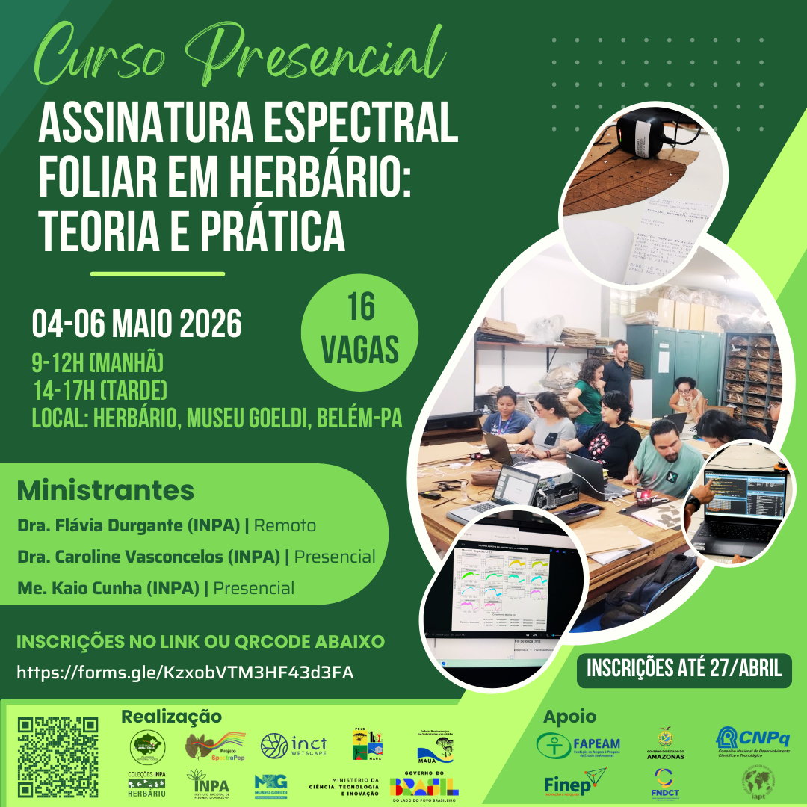

# Apresentação

Sejam bem-vindos(as)! 😊

Este curso foi desenvolvido para capacitar estudantes e profissionais no
uso do espectrômetro portátil NIR, abrangendo desde a configuração
inicial do equipamento até a análise dos dados espectrais.

Ao longo de três dias de atividades teóricas e práticas, os
participantes explorarão os fundamentos da espectroscopia no
infravermelho próximo (NIR) e sua aplicação na identificação de plantas.

<figure style="text-align:center;">

{.slide style="display:block;"}

<figcaption style="font-size:0.9rem; color:#555; margin-top:6px;">

Flyer de divulgação do curso no Herbário do Museu Paraense Emílio
Goeldi.

</figcaption>

</figure>

# Detalhes do curso

**Onde:** Herbário MG, Campus de Pesquisa - Museu Paraense Emílio
Goeldi, Av. Perimetral, 1901 - 66077-830 - Terra Firme, Belém, Pará.

```{r echo=FALSE, message=FALSE, warning=FALSE}
library(leaflet)
leaflet() %>%
  addTiles %>% # Add default OpenStreetMap map tiles
  setView(lng = -48.443668, lat = -1.451330, zoom = 17)
```

**Data:** De 04 a 06 de maio de 2026.\

**Público-alvo:** Estudantes e profissionais envolvidos no fluxo de
trabalho de herbário/coleções de referência que tenham interesse no uso
de espectroscopia portátil para pesquisa científica.\

**Número de vagas:** 16 (vagas presenciais).\

**Carga horária:** 18h (com emissão de certificado de participação).\

**Formato:** Curso presencial, com aulas teóricas transmitidas ao vivo
em ambiente virtual e atividades práticas realizadas presencialmente. Para as atividades práticas, quatro laptops estarão disponíveis, e os
participantes serão organizados em quatro grupos.

**Material:** Slides e *scripts* serão disponibilizados diretamente aos participantes ou via [Download](/download.html).

# Cronograma

## Visão geral

As atividades do curso ocorrerão durante três dias seguidos, de segunda
a quarta-feira.

As sessões da manhã serão entre 09h00 e 12h00 (horário local de Belém).

As sessões da tarde serão entre 14h00 e 17h00 (horário local de Belém).

## Linha do tempo

### Dia 1 (segunda-feira, 04/mai)

#### Manhã (Flávia Durgante)

-   Fundamentos teóricos da espectroscopia NIR e suas aplicações (parte I)

Acesso à aula: <https://meet.jit.si/CursoGoeldi>

Material complementar: Vídeo – Tour do Espectro Eletromagnético (NASA):
<https://www.youtube.com/watch?v=2p7FPFvu_j0>

#### Tarde (Caroline Vasconcelos, Kaio Cunha e Gabrielly Ribeiro)

-   Apresentação do dispositivo NIR-S-G1 (InnoSpectra Corp.) e acessórios

-   Configuração do aplicativo ISC-NIRScan GUI (*laptop* e *smartphone*)

-   Introdução ao fluxo de trabalho com o NIR portátil


### Dia 2 (terça-feira, 05/mai)

#### Manhã (Caroline Vasconcelos, Kaio Cunha e Gabrielly Ribeiro)

- Exercício prático de aquisição de espectros e metadados de exsicatas. 
- As espécies listadas a seguir serão testadas durante o curso:

<iframe src="https://docs.google.com/spreadsheets/d/1nDfQMOe26fblt0OLafKL6Gx1h7syhyFjfGT0lVjOYj4/edit?usp=sharing" width="100%" height="600">

</iframe>

#### Tarde (Caroline Vasconcelos, Kaio Cunha e Gabrielly Ribeiro)

-   Em ambiente R:
    -   Instalação e carregamento das bibliotecas necessárias
    -   Importação de dados espectrais
    -   Visualização e avaliação da qualidade dos espectros
    -   Preparação dos dados para análise

### Dia 3 (quarta-feira, 06/mai)

#### Manhã (Flávia Durgante)

-   Fundamentos teóricos da espectroscopia NIR e suas aplicações (parte II)
-   Introdução às análises espectrais

Acesso à aula: <https://meet.jit.si/CursoGoeldi>

#### Tarde (Caroline Vasconcelos, Kaio Cunha e Gabrielly Ribeiro)

-   Em ambiente R:
    -   Análise discriminante (LDA) com validação cruzada Leave-One-Out (LOO)
    -   Avaliação de desempenho (acurácia e matriz de confusão)
    -   Interpretação dos resultados

# Equipe de organização e treinamento

 Profa. Dra. Flávia Durgante
(Coordenadora dos Projetos SpectraPop/HerbSpectra-Amazônia),
MAUA/ATTO/INPA
<a href="http://lattes.cnpq.br/9866263113578229" target="_blank"></a>

 Dra. Caroline Vasconcelos
(Bolsista do Projeto HerbSpectra-Amazônia), MAUA/INPA
<a href="http://lattes.cnpq.br/1535461703335857" target="_blank"></a>

{width="12"} Me. Kaio Cunha (Bolsista do Projeto
HerbSpectra-Amazônia), MAUA/INPA
<a href="http://lattes.cnpq.br/2664299098538335" target="_blank">{width="18"}</a>

 Me. Gabrielly Guabiraba Ribeiro
(Doutoranda), JBRJ
<a href="http://lattes.cnpq.br/4435352680317467" target="_blank"></a>

# Financiamento

Este curso é apoiado pelos projetos "Rede de Herbários Espectrais da
Amazônia: Espectroscopia e inteligência artificial para a identificação
automatizada da biodiversidade em herbários amazônicos -
HerbSpectra-Amazônia", financiado pelo Conselho Nacional de
Desenvolvimento Científico e Tecnológico (CNPq), Chamada Pública
MCTI/CNPq no. 03/2025 - Pró-Amazônia (processo no. 385465/2025-4);
"Building a near-infrared spectral library to reveal new species of
Ecclinusa (Sapotaceae, Chrysophylloideae) in South America", financiado
pela International Association for Plant Taxonomy (IAPT, rodada 2025); e
"Popularização do uso da Assinatura Espectral da Espécie na
identificação das árvores do Manejo Florestal Sustentável na Amazônia -
SPECTRA POP”, financiado pela Fundação de Amparo à Pesquisa do Estado do
Amazonas (FAPEAM), Edital no. 006/2024 - Mulher Faz Ciência (Processo
no. 01.02.016301.04984/2024-17). O curso também conta com apoio do
Herbário INPA via Chamada pública MCTI/FINEP/FNDCT no. 02/2016 – Centros
Nacionais Multiusuários.

# Participantes

1.  Adson Jordan Moreira Corrêa
2.  Alcindo da Silva Martins Junior
3.  André Gil
4.  Anna Luiza Ilkiu
5.  Antônio Augusto de Souza Costa
6.  Antônio Elielson Rocha
7.  Charles Ricardo Ferreira Reis
8.  Ely Simone Gurgel
9.  Emilli Larissa Silva de Oliveira
10. Fábio de Jesus Batista
11. Gustavo Batista Borges
12. Joseane Monteiro
13. Julia Meireles
14. Karina de Nazaré Lima Alves
15. Maria Antônia Ferreira Goes
16. Maria de Fátima Almeida

# Certificado

Para gerar seu certificado preencha o formulário:
<https://forms.gle/3R5HoPVWErxvzQDY8>
