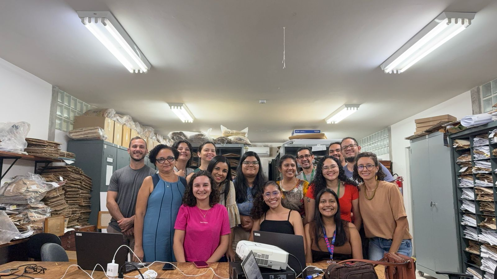

# Apresentação

Damos boas-vindas aos participantes do **1º Curso Espectroscopia em Herbário com MicroNIR: Teoria e Prática**! 😊

Este curso foi desenvolvido para capacitar funcionários e bolsistas no uso do espectrômetro portátil MicroNIR, abrangendo desde a configuração inicial do equipamento até a análise dos dados espectrais.

Ao longo de três dias de atividades teóricas e práticas, os participantes explorarão os fundamentos da espectroscopia no infravermelho próximo (NIR) e sua aplicação na identificação de plantas.

Além disso, o curso busca identificar desafios práticos no uso do equipamento, contribuindo para o desenvolvimento de um protocolo de aplicação no âmbito do [Projeto SpectraPop](/index.html).

# Detalhes do curso

**Onde:** Herbário INPA (1º andar, Sala IFN), Av. André Araújo, 2.936 - 69067-375 - Petrópolis, Manaus, Amazonas.

```{r echo=FALSE, message=FALSE, warning=FALSE}
library(leaflet)
leaflet() %>%
  addTiles %>% # Add default OpenStreetMap map tiles
  setView(lng = -59.98748286262644, lat = -3.0950992004397473, zoom = 17)
```

**Data:** De 02 a 04 de abril de 2025.\

**Público-alvo:** Funcionários e bolsistas envolvidos no fluxo de trabalho do herbário que tenham interesse no uso de espectroscopia portátil para pesquisa científica.\

**Número de vagas:** 13 (participantes previamente selecionados).\

**Carga horária:** 18h (com emissão de declaração de participação).\

**Formato:** Híbrido, com aulas teóricas virtuais e aulas práticas presenciais. Quatro *laptops* estarão disponíveis para as aulas práticas, e as atividades serão realizadas em quatro grupos.

**Material:** Slides, *scripts* e dados obtidos durante o curso serão disponibilizados diretamente aos alunos ou via [GitHub](https://github.com/ccvasconcelos/spectrapop).

**Observações importantes:**

-   Participantes externos devem apresentar um documento de identificação com foto (p. ex. RG) e informar em qualquer portaria do INPA que estão [participando de um treinamento no Herbário INPA]{.underline}.

-   Para as aulas teóricas, os participantes podem assistir de casa ou utilizar as dependências do INPA. Se este último for o seu caso, por favor, avise-nos com antecedência.

-   Ao final do curso, cada participante deve responder um formulário de aproveitamento para avaliação da capacitação e sugestões para aprimoramento do protocolo de uso do MicroNIR, que futuramente será disponibilizado para toda a comunidade interessada.

# Cronograma

## Visão geral

As atividades do workshop ocorrerão durante três dias seguidos, de quarta a sexta-feira.

As sessões da manhã serão entre 09h00 e 12h00 (horário padrão do Amazonas).

As sessões da tarde serão entre 14h00 e 17h00 (horário padrão do Amazonas).

## Linha do tempo

### Dia 1 (quarta-feira)

#### Manhã (Flávia)

Fundamentos teóricos da espectroscopia NIR e suas aplicações

Link para acessar a aula: [[https://meet.jit.si/Spectrapop]{.underline}](https://meet.jit.si/Spectrapop)

Link para acessar a lista de presença: <https://forms.gle/PTZiQRaphvAgcDwu7>

Vídeo Tour do Espectro Eletromagnético (NASA): <https://www.youtube.com/watch?v=2p7FPFvu_j0>

#### Tarde (Caroline)

-   Apresentação do dispositivo NIR-S-G1 (MicroNIR, InnoSpectra Corp.) e acessórios

-   Configuração do aplicativo ISC-NIRScan GUI (*laptop* e *smartphone*)

-   Calibração, coleta de dados espectrais e cuidados necessários na obtenção dos espectros

-   Entendendo os arquivos de saída

Link para acessar a lista de presença: <https://forms.gle/7Y52iFG1BNhstmey6>

### Dia 2 (quinta-feira)

#### Manhã (Caroline)

Exercício prático de aquisição de leituras espectrais - Exemplo com algumas das espécies CITES (Convenção sobre o Comércio Internacional das Espécies Silvestres Ameaçadas de Extinção) listadas abaixo:

|        |                  |                             |
|--------|------------------|-----------------------------|
| **Id** | **Família**      | **Espécie**                 |
| **1**  | **Bignoniaceae** | ***Handroanthus barbatus*** |
| 2      | Bignoniaceae     | *H. capitatus*              |
| **3**  | **Bignoniaceae** | ***H. impetiginosus***      |
| **4**  | **Bignoniaceae** | ***H. incanus***            |
| **5**  | **Bignoniaceae** | ***H. ochraceus***          |
| 6      | Bignoniaceae     | *H. serratifolius*          |
| 7      | Bignoniaceae     | *Tabebuia aurea*            |
| 8      | Bignoniaceae     | *T. insignis*               |
| 9      | Meliaceae        | *Cedrela odorata*           |
| 10     | Fabaceae         | *Dipteryx magnifica*        |
| 11     | Fabaceae         | *D. odorata*                |
| 12     | Fabaceae         | *D. polyphylla*             |
| 13     | Fabaceae         | *D. punctata*               |

Link para acessar a lista de presença: <https://forms.gle/ucjn7CXmNSVrbKdH7>

#### Tarde (Caroline)

-   Instalação das bibliotecas necessárias

-   Como importar as leituras espectrais para o R

-   Como visualizar espectros e avaliar a qualidade dos dados espectrais

-   Como preparar os conjuntos de dados para análise

Link para acessar a lista de presença: <https://forms.gle/WnXsJYpzR1aw5kxT8>

### Dia 3 (sexta-feira)

#### Manhã (Flávia)

Fundamentos teóricos da espectroscopia NIR e suas aplicações

Link para acessar a aula: [[https://meet.jit.si/Spectrapop]{.underline}](https://meet.jit.si/Spectrapop)

Link para acessar a lista de presença: <https://forms.gle/j6JUzh1RKtncAZT67>

#### Tarde (Caroline)

-   Análise discriminante (LDA) com validação cruzada *Leave-One-Out* (LOO)

-   Avaliação básica dos modelos (acurácia e matriz de confusão)

-   Responder formulário de aproveitamento do curso

Link para acessar a lista de presença: [[https://forms.gle/BtVwHsepLdAKL55R7]{.underline}](https://forms.gle/BtVwHsepLdAKL55R7)

Link para acessar acessar o formulário de feedback: <https://forms.gle/jFX8RhJp2MVVybRa9>

# Equipe de organização e treinamento

👤Profa. Dra. [Flávia Durgante](http://lattes.cnpq.br/9866263113578229) (Coordenadora do Projeto SpectraPop), KIT/ MAUA/INPA

👤Dra. [Caroline Vasconcelos](http://lattes.cnpq.br/1535461703335857) (Bolsista AT/III do Projeto SpectraPop), INPA

👤Prof. Dr. [Michael Hopkins](http://lattes.cnpq.br/5738793047673962) (Colaborador), Curadoria do Herbário INPA

# Financiamento

Este curso é parte do Projeto “Popularização do uso da Assinatura Espectral da Espécie na identificação das árvores do Manejo Florestal Sustentável na Amazônia - SPECTRA POP”, financiado pela Fundação de Amparo à Pesquisa do Estado do Amazonas (FAPEAM), Edital no. 006/2024 - Mulher Faz Ciência (Processo no. 01.02.016301.04984/2024-17), e apoiado pelo Herbário INPA via Chamada pública MCTI/FINEP/FNDCT no. 02/2016 – Centros Nacionais Multiusuários.

# Participantes

1.  Adriane Maciel

2.  Camila Mayara Gessner

3.  Cecile Cássio

4.  Claudia Eugênio

5.  Francisco Farroñay

6.  Heitor Felippe Uller

7.  Kellin Vanessa Andriguetto

8.  Kely da Silva Cruz

9.  Lourdes Cristina

10. Marly Castro

11. Nory Daniel

12. Ruby Vargas

13. Samyra Ramos

**Ouvintes (participação parcial)\***

1.  Maria Clara Ferro - Virtual/Presencial

2.  Natália Deggau da Costa - Virtual

3.  Thiago Caique Alves - Virtual

4.  Marcos Vinicius Vizioli Klaus - Virtual

\*Ouvintes (virtuais e presenciais) não terão direito a certificado.

<figure style="text-align:center;">
  
  <figcaption style="font-size:0.9rem; color:#555; margin-top:6px;">
        Participantes do 1º Curso do Projeto SpectraPop, Herbário INPA, abril de 2025.
  </figcaption>
</figure>
