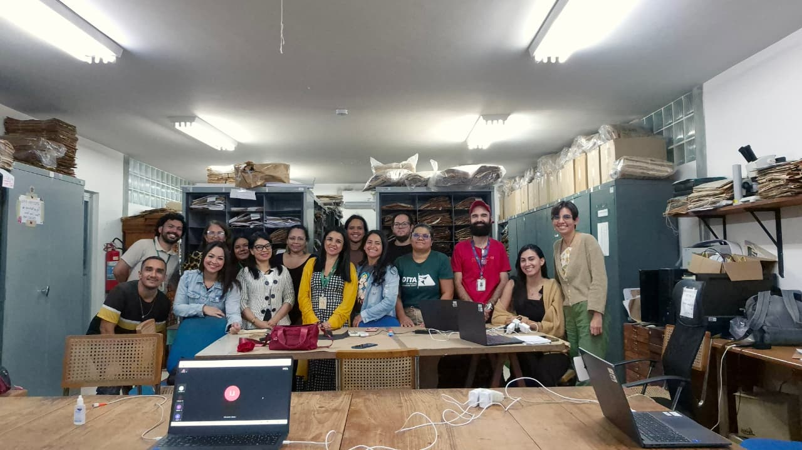

# Apresentação

Damos boas-vindas aos participantes do **2º Curso Espectroscopia em Herbário com MicroNIR: Teoria e Prática**! 😊

Este curso foi desenvolvido para capacitar estudantes e profissionais no uso do espectrômetro portátil MicroNIR, abrangendo desde a configuração inicial do equipamento até a análise dos dados espectrais.

Ao longo de três dias de atividades teóricas e práticas, os participantes explorarão os fundamentos da espectroscopia no infravermelho próximo (NIR) e sua aplicação na identificação de plantas.

Além disso, o curso busca identificar desafios práticos no uso do equipamento, contribuindo para o desenvolvimento de um protocolo padronizado de aplicação no âmbito do [Projeto SpectraPop](/index.html).

# Detalhes do curso

**Onde:** Sala de aula do PPG-Botânica e Herbário INPA, Instituto Nacional de Pesquisas da Amazônia (INPA, campus I), Av. André Araújo, 2.936 - 69067-375 - Petrópolis, Manaus, Amazonas.

```{r echo=FALSE, message=FALSE, warning=FALSE}
library(leaflet)
leaflet() %>%
  addTiles %>% # Add default OpenStreetMap map tiles
  setView(lng = -59.98748286262644, lat = -3.0950992004397473, zoom = 17)
```

**Data:** De 17 a 19 de dezembro de 2025.\

**Público-alvo:** Estudantes e profissionais envolvidos no fluxo de trabalho de herbário/coleções de referência que tenham interesse no uso de espectroscopia portátil para pesquisa científica.\

**Número de vagas:** 20 (vagas presenciais).\

**Carga horária:** 18h (com emissão de certificado de participação).\

**Formato:** Híbrido, contemplando aulas teóricas ministradas em ambiente virtual, com opção de participação presencial em sala de aula no INPA, e aulas práticas exclusivamente presenciais. Para as atividades práticas, quatro laptops estarão disponíveis, e os participantes serão organizados em quatro grupos.

**Material:** Slides, *scripts* e dados obtidos durante o curso serão disponibilizados diretamente aos alunos ou via [GitHub](https://github.com/ccvasconcelos/spectrapop).

**Observações importantes:**

-   Participantes externos devem apresentar um documento de identificação com foto (p. ex. RG) e informar em qualquer portaria do INPA que estão [participando de um treinamento no Herbário INPA]{.underline}.

-   Ao final do curso, cada participante deve responder um formulário de aproveitamento para avaliação da capacitação e sugestões para aprimoramento do protocolo de uso do MicroNIR, que futuramente será disponibilizado para toda a comunidade interessada.

# Cronograma

## Visão geral

As atividades do curso ocorrerão durante três dias seguidos, de quarta a sexta-feira.

As sessões da manhã serão entre 09h00 e 12h00 (horário padrão do Amazonas).

As sessões da tarde serão entre 14h00 e 17h00 (horário padrão do Amazonas).

## Linha do tempo

### Dia 1 (quarta-feira, 17/dez)

#### Manhã (Flávia)

Fundamentos teóricos da espectroscopia NIR e suas aplicações

Link para acessar a aula: <https://meet.jit.si/CursoSpectraPop>

Link para acessar a lista de presença: <https://forms.gle/a2zAf1EhNPwFJcek6>

Vídeo Tour do Espectro Eletromagnético (NASA): <https://www.youtube.com/watch?v=2p7FPFvu_j0>

#### Tarde (Caroline)

-   Apresentação do dispositivo NIR-S-G1 (MicroNIR, InnoSpectra Corp.) e acessórios

-   Configuração do aplicativo ISC-NIRScan GUI (*laptop* e *smartphone*)

-   Calibração, coleta de dados espectrais e cuidados necessários na obtenção dos espectros

-   Entendendo os arquivos de saída

Link para acessar a lista de presença: <https://forms.gle/UUx6esK5UtvfUoNs5>

### Dia 2 (quinta-feira, 18/dez)

#### Manhã (Luiz e Caroline)

Operações com o micronir e exercício prático de aquisição espectros.

Obtenção de metadados associados aos espécimes de herbário.

Link para acessar a lista de presença: <https://forms.gle/fWo12i6eGNRvphZ38>

#### Tarde (Caroline)

-   Instalação das bibliotecas necessárias

-   Como importar as leituras espectrais para o R

-   Como visualizar espectros e avaliar a qualidade dos dados espectrais

-   Como preparar os conjuntos de dados para análise

Link para acessar a lista de presença: <https://forms.gle/6rTMCeVAexLfMfeN8>

### Dia 3 (sexta-feira, 19/dez)

#### Manhã (Flávia)

Fundamentos teóricos da espectroscopia NIR e suas aplicações

Link para acessar a aula: <https://meet.jit.si/CursoSpectraPop>

Link para acessar a lista de presença: <https://forms.gle/TzM6XT7Y8AfPhQ8F7>

#### Tarde (Caroline)

-   Análise discriminante (LDA) com validação cruzada *Leave-One-Out* (LOO)

-   Avaliação básica dos modelos (acurácia e matriz de confusão)

-   Responder formulário de aproveitamento do curso

Link para acessar a lista de presença: <https://forms.gle/metm2uActUHtmSZr7>

Link para acessar acessar o formulário de feedback: <https://forms.gle/GPvYc9k3WZgeBdXX8>


# Equipe de organização e treinamento

{width="16"} Profa. Dra. [Flávia Durgante](http://lattes.cnpq.br/9866263113578229) (Coordenadora do Projeto SpectraPop), KIT/ INPA/MAUA/ATTO

{width="16"} Dra. [Caroline Vasconcelos](http://lattes.cnpq.br/1535461703335857) (Bolsista do Projeto SpectraPop), INPA

{width="16" style="font-size: 11pt;"} Prof. Dr. [Michael Hopkins](http://lattes.cnpq.br/5738793047673962) (Colaborador), Curadoria do Herbário INPA

{width="16" style="font-size: 11pt;"} Dra. [Samyra Ramos](http://lattes.cnpq.br/1333559162162849) (Colaboradora), INPA

{width="16" style="font-size: 11pt;"} Me. [Kaio Cunha](http://lattes.cnpq.br/2664299098538335) (Colaborador), INPA

{width="16" style="font-size: 11pt;"} Me. [Luiz Melo](http://lattes.cnpq.br/0848738423393318) (Colaborador), INPA

# Financiamento

Este curso é parte do Projeto “Popularização do uso da Assinatura Espectral da Espécie na identificação das árvores do Manejo Florestal Sustentável na Amazônia - SPECTRA POP”, financiado pela Fundação de Amparo à Pesquisa do Estado do Amazonas (FAPEAM), Edital no. 006/2024 - Mulher Faz Ciência (Processo no. 01.02.016301.04984/2024-17), e apoiado pelo Herbário INPA via Chamada pública MCTI/FINEP/FNDCT no. 02/2016 – Centros Nacionais Multiusuários.

# Participantes

Lista atualizada em 16-12-2025:

1.  Álvaro Brasil Barbosa Neto

2.  Ana Leticia Reis Almeida

3.  Ana Paula Alfaia Castro

4.  Caris Viana

5.  Cristiane Cunha Guimarães

6.  Eduardo Cunha

7.  Flávia Dayane Félix Farias

8.  Gabriel Caldas

9.  Giovanni Melo de Lima

10. Jaqueline Ferreira Gomes

11. Jéssica Iara Soares

12. Katell Uguen

13. Kellen Trajano de Lima

14. Maria Clara Ferro

15. Patricia Alfaia Pereira

16. Paula Ribeiro

17. Sérgio Dantas de Oliveira Júnior

18. Túlio Alex Martins

**Ouvintes (participação parcial)\***

1.  Ana Luiza Tuma - Virtual

2.  Eliandra Rodrigues - Virtual

3.  Yasmin Guimarães - Virtual

\*Ouvintes (virtuais e presenciais) não terão direito a certificado.

# Certificados

Para gerar seu certificado preencha o formulário: <https://forms.gle/XGg3XCmdMGUPxqCq9>

<figure style="text-align:center;">

{.slide style="display:block;"}

<figcaption style="font-size:0.9rem; color:#555; margin-top:6px;">

Participantes do 2º Curso do Projeto SpectraPop, Herbário INPA, dezembro de 2025.

</figcaption>

</figure>
