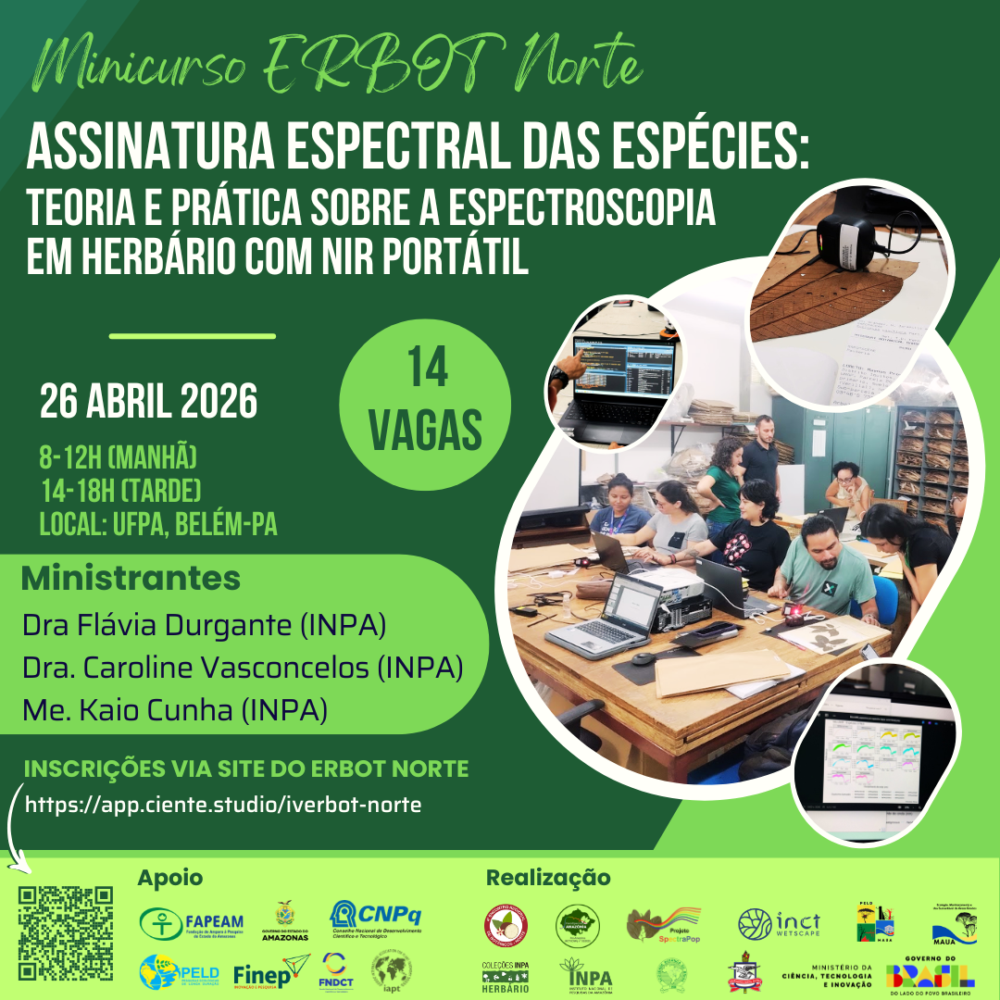
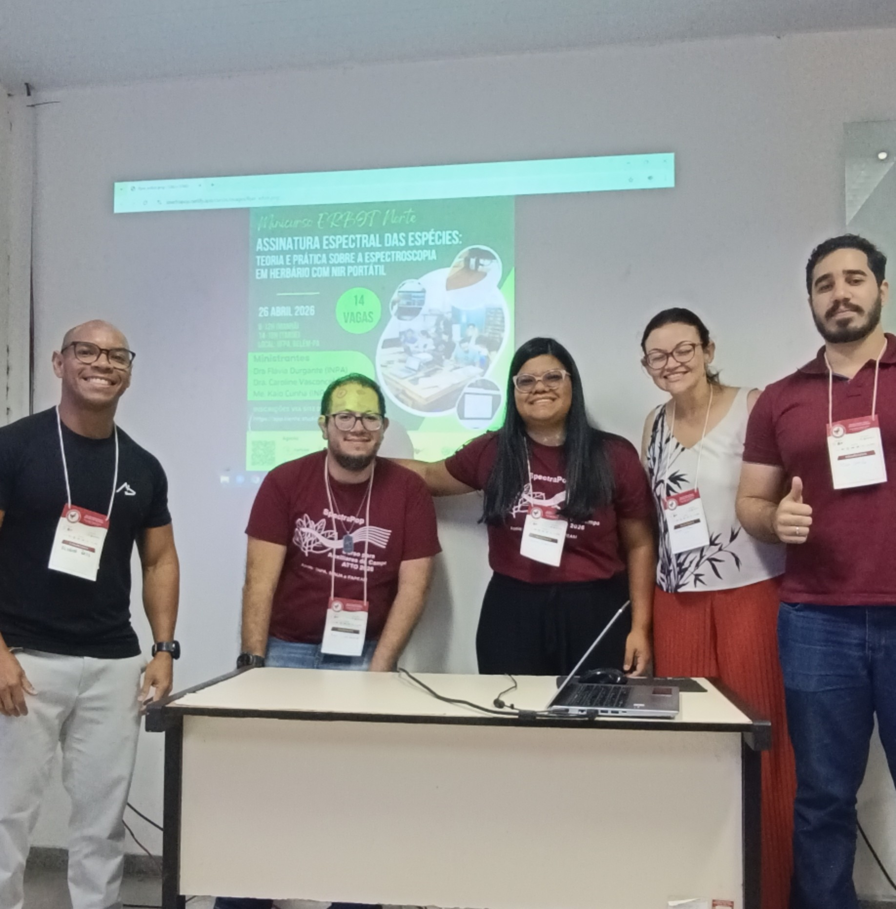

# Apresentação

Sejam bem-vindos(as)!

Este curso foi desenvolvido para capacitar estudantes e profissionais no
uso de espectrômetros portáteis de infravermelho próximo (NIR). Ao longo
do dia, os participantes explorarão os fundamentos da espectroscopia no
NIR e suas aplicações na identificação de plantas em contexto de
herbário.

Serão também abordados, de forma teórica e prática, os principais fluxos
de trabalho analíticos, incluindo aquisição de espectros e controle de
qualidade (para fins demonstrativos), curadoria de dados espectrais e
análises aplicadas à discriminação de espécies.

<figure style="text-align:center;">

{.slide style="display:block;"}

<figcaption style="font-size:0.9rem; color:#555; margin-top:6px;">

Flyer de divulgação do minicurso no ERBOT Norte 2026.

</figcaption>

</figure>

# Detalhes do curso

**Onde:** ICB, Universidade Federal do Pará (UFPA), Av. Perimetral,
2-224 - 66077-830 - Guamá, Belém, Pará.

```{r echo=FALSE, message=FALSE, warning=FALSE}
library(leaflet)
leaflet() %>%
  addTiles %>% # Add default OpenStreetMap map tiles
  setView(lng = -48.457588, lat = -1.473429, zoom = 17)
```

**Data:** 26 de abril de 2026.\

**Público-alvo:** Estudantes e profissionais envolvidos no fluxo de
trabalho de herbário/coleções de referência que tenham interesse no uso
de espectroscopia portátil para pesquisa científica.\

**Número de vagas:** 14 (vagas presenciais).\

**Carga horária:** 7h (certificado de participação a ser emitido pela
organização do ERBOT Norte).\

**Formato:** Curso presencial, com aula teórica transmitida ao vivo em
ambiente virtual e atividades práticas realizadas presencialmente.

**Material:** Slides e *scripts* serão disponibilizados diretamente aos
participantes ou via [Download](/download.html).

# Cronograma

## Visão geral

As atividades do curso serão realizadas em período integral, das 8h00 às
12h00, com intervalo para almoço, e das 14h00 às 17h00 (horário local de
Belém).

> ⚠️ **Atenção (almoço):**\
> Por se tratar de um domingo, os restaurantes da UFPA não estarão em
> funcionamento.\
> A organização do evento viabilizou uma refeição no valor de R\$ 17,00
> por pessoa (cardápio: chapa mista ou filé de frango empanado).
> Interessados devem entrar em contato com Jesiane \[link removido\],
> realizar o pagamento via PIX para este número e enviar o comprovante.

## Linha do tempo

### Manhã (aula ministrada virtualmente por Flávia Durgante)

-   Fundamentos da espectroscopia no infravermelho próximo (NIR)
-   Aplicações em herbários e identificação de espécies
-   Introdução a análises espectrais

Acesso à aula: <https://meet.jit.si/MinicursoERBOT2026>

Material complementar: Vídeo – Tour do Espectro Eletromagnético (NASA)
<https://www.youtube.com/watch?v=2p7FPFvu_j0>

### Tarde (aula ministrada por Caroline Vasconcelos e Kaio Cunha)

**Demonstração prática do NIR portátil**

-   Apresentação do dispositivo NIR-S-G1 (InnoSpectra Corp.), acessórios
    e aplicativo\
-   Demonstração da aquisição de espectros em exsicatas (amostras de
    referência)\

**Análises em R**\
*(utilizando conjunto de dados previamente disponibilizado —*
<https://doi.org/10.5281/zenodo.15531968>*)*

-   Instalação e carregamento das bibliotecas necessárias\
-   Importação de dados espectrais\
-   Visualização e avaliação da qualidade dos espectros\
-   Preparação dos dados para análise\
-   Análise discriminante (LDA) com validação cruzada Leave-One-Out
    (LOO)\
-   Avaliação de desempenho (acurácia e matriz de confusão)

# Equipe de organização e treinamento

 Profa. Dra. Flávia Durgante
(Coordenadora dos Projetos SpectraPop/HerbSpectra-Amazônia),
MAUA/ATTO/INPA
<a href="http://lattes.cnpq.br/9866263113578229" target="_blank"></a>

 Dra. Caroline Vasconcelos
(Bolsista do Projeto HerbSpectra-Amazônia), MAUA/INPA
<a href="http://lattes.cnpq.br/1535461703335857" target="_blank"></a>

 Me. Kaio Cunha (Bolsista do
Projeto HerbSpectra-Amazônia), MAUA/INPA
<a href="http://lattes.cnpq.br/2664299098538335" target="_blank"></a>

# Financiamento

Este curso é apoiado pelos projetos "Rede de Herbários Espectrais da
Amazônia: Espectroscopia e inteligência artificial para a identificação
automatizada da biodiversidade em herbários amazônicos -
HerbSpectra-Amazônia", financiado pelo Conselho Nacional de
Desenvolvimento Científico e Tecnológico (CNPq), Chamada Pública
MCTI/CNPq no. 03/2025 - Pró-Amazônia (processo no. 385465/2025-4);
"Building a near-infrared spectral library to reveal new species of
*Ecclinusa* (Sapotaceae, Chrysophylloideae) in South America",
financiado pela International Association for Plant Taxonomy (IAPT,
rodada 2025); e "Popularização do uso da Assinatura Espectral da Espécie
na identificação das árvores do Manejo Florestal Sustentável na
Amazônia - SPECTRA POP”, financiado pela Fundação de Amparo à Pesquisa
do Estado do Amazonas (FAPEAM), Edital no. 006/2024 - Mulher Faz Ciência
(Processo no. 01.02.016301.04984/2024-17). O curso também conta com
apoio do Herbário INPA via Chamada pública MCTI/FINEP/FNDCT no. 02/2016
– Centros Nacionais Multiusuários.

# Participantes inscritos

1.  Alisson Reis (participação presencial)

2.  Carla Rebeca Santos Souza

3.  Ely Simone Cajuero Gurgel

4.  Grazielle Sales Teodoro (participação híbrida)

5.  Loarena Leal Cruz

6.  Lucas de Jesus Camilo (participação presencial)

7.  Mellissa Sousa Sobrinho (participação remota)

<figure style="text-align:center;">

{.slide fig-align="right" style="display:block;"
width="100%"}

<figcaption style="font-size:0.9rem; color:#555; margin-top:6px;">

Participantes do Minicurso no 4º ERBOT Norte 2026 em Belém-PA, abril de
2026

</figcaption>

</figure>
