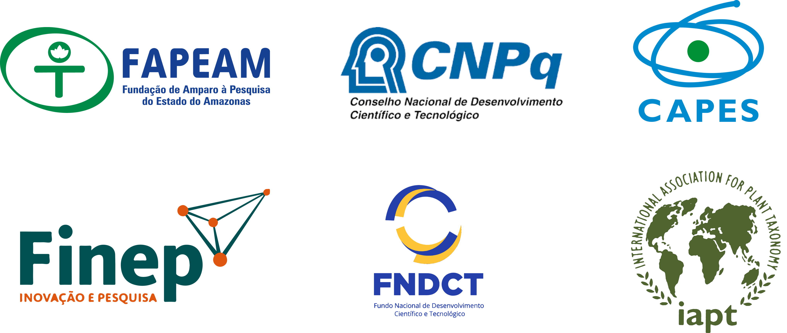
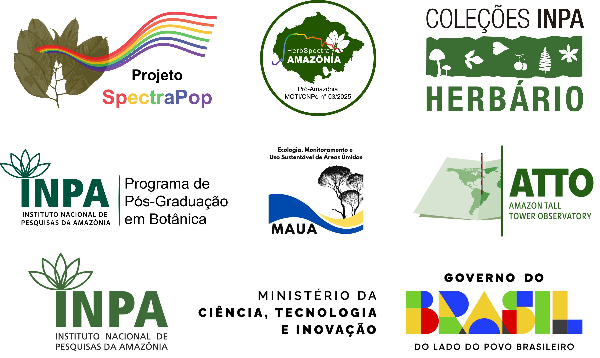

# Resumo

Erros na identificação de espécies madeireiras afetam toda a cadeia produtiva do manejo florestal, desde a sustentabilidade do manejo de espécies de alto valor comercial para futuros ciclos de exploração, até a fiscalização e a venda e comercialização da madeira. Assim, buscando aprimorar o processo de identificação de espécies para o manejo florestal sustentável, esta proposta visa desenvolver e popularizar o uso da assinatura espetral das espécies na identificação de espécies de alto valor comercial. O uso combinado de instrumentos de alta tecnologia e técnicas apropriadas para discriminar espécies arbóreas é necessário para melhorar o sistema de inventário da biodiversidade em países tropicais. A espetroscopia foliar no infravermelho próximo tem-se mostrado promissora na discriminação de espécies vegetais. Desta forma, pretendemos produzir um herbário espetral, utilizar protocolos, testar equipamentos mais acessíveis e treinar pessoas de diferentes grupos da sociedade. Assim, acreditamos na popularização do uso dessa ferramenta desenvolvida no Instituto Nacional de Pesquisas da Amazônia para melhorar a qualidade das identificações do manejo florestal na Amazônia. A popularização e aplicação dessa ferramenta aumentará a sustentabilidade do manejo florestal no estado do Amazonas. Desta forma, este projeto visa desenvolver e popularizar uma tecnologia que beneficiará o Amazonas ambiental, social e economicamente.

# Objetivo geral

Desenvolver e popularizar o herbário espectral (espectroscopia no infravermelho próximo) de espécies madeireiras e não madeireiras de alto valor comercial para aplicar no manejo florestal sustentável do estado do Amazonas.

# Integrantes

## Coordenação

</a> **Flávia M. Durgante** (INPA/MAUA/ATTO) 

## Pesquisadores colaboradores

</a> **Florian Wittmann** (KIT/MAUA/ATTO) 

</a> **Jochen Schöngart** (INPA/MAUA/ATTO) 

</a> **Maria T. F. Piedade** (INPA/ATTO/MAUA) 

</a> **Layon O. Demarchi** (INPA/MAUA) 

</a> **Alberto Vicentini** (INPA) 

</a> **Michael J. G. Hopkins** (INPA) 

</a> **Kelly C. Torralvo** (IDSM) 

</a> **Rafael M. Rabelo** (IDSM) 

</a> **Darlene Gris** (IDSM) 

## Bolsistas

### Pós-doutorado

</a> **Caroline C. Vasconcelos** (INPA/MAUA) - Bolsista CNPq DTI-A  [(bolsa em andamento)]{style="color:GREEN;"}

</a> **Samyra Ramos Chaves** (INPA/MAUA) - Bolsista FAPEAM AT/III  [(bolsa em andamento)]{style="color:green;"}

### Pós-graduação (Mestrado e Doutorado)

</a> **Maria Clara A. M. O. Ramos Ferro** (INPA/MAUA) - Bolsista CAPES Mestrado  [(bolsa em andamento)]{style="color:green;"}

</a> **Túlio Alex Martins da Silva** (INPA/MAUA) - Bolsista CAPES Doutorado <a href="https://orcid.org/0009-0008-2315-1932" target="_blank">{width="18"}</a> [(bolsa em andamento)]{style="color:green;"}

</a> **Caroline L. Mallmann** (UFSM) - Doutoranda 

</a> **Hilana L. Hadlich** (INPA/MAUA) - Doutoranda - Bolsista CNPq DTI-B  [(bolsa em andamento)]{style="color:green;"}

</a> **Kaio Cesar M. da Cunha** (INPA/MAUA) - Mestre - Bolsista CNPq DTI-B <a href="https://orcid.org/0000-0003-2197-9687" target="_blank">{width="18"}</a> [(bolsa em andamento)]{style="color:green;"}

### Graduação (PIBICs)

</a> **Cassia Sousa Ataide** (UFAM) - Bolsista CNPq PIBIC  [(bolsa em andamento)]{style="color:green;"}

</a> **Eliandra Rodrigues Ferreira** (Estácio) - Bolsista CNPq PIBIC  [(bolsa em andamento)]{style="color:green;"}

</a> **Yasmin Jéssica Guimarães Guedes** (UFAM) - Bolsista CNPq PIBIC  [(bolsa em andamento)]{style="color:green;"}

</a> **Eduardo Leandro Cunha** (UFAM) - Bolsista CNPq PIBIC  [(egresso)]{style="color:red;"}

# Cursos oferecidos

📚 [**1º Curso**](/cursos/cursomicronir1.html)**:** 02 a 04 de abril de 2025 (INPA, Manaus, AM)

📚 [**2º Curso**](/cursos/cursomicronir2.html)**:** 17 a 19 de dezembro de 2025 (INPA, Manaus, AM)

📚 [**3º Curso**](/cursos/cursomicronir3.html)**:** previsto para o período de 19 a 21 de maio de 2026 (Instituto Mamirauá, Tefé, AM)

📚 [**Curso Auxiliar de Campo**](/cursos/cursoauxiliardecampo.html)**:** 23 a 30 de março de 2026 (Sítio ATTO, São Sebastião do Uatumã, AM)

# Financiamento

O projeto SPECTRA POP é financiado pela Fundação de Amparo à Pesquisa do Estado do Amazonas (FAPEAM), Edital no. 006/2024 - Mulher Faz Ciência (Processo no. 01.02.016301.04984/2024-17), e apoiado pelo Herbário INPA via Chamada pública MCTI/FINEP/FNDCT no. 02/2016 – Centros Nacionais Multiusuários.

# Realização

