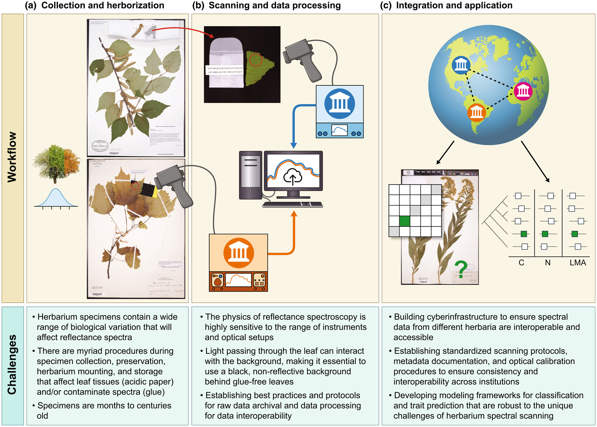
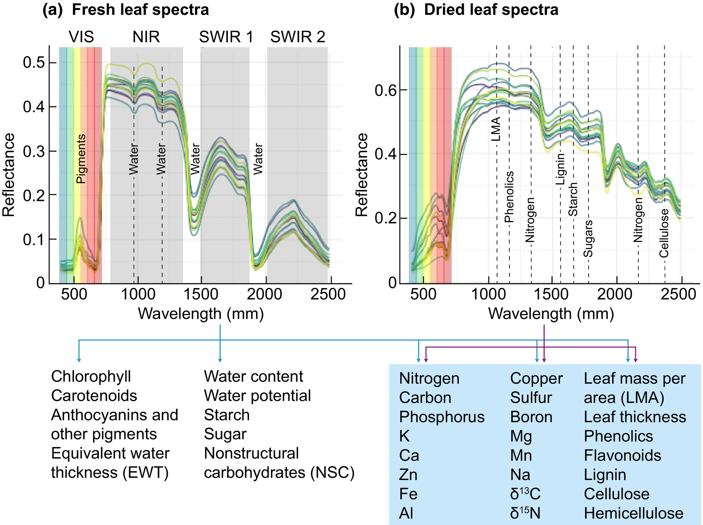

O estudo, intitulado **"Next-generation specimen digitization: capturing reflectance spectra from the world’s herbaria for modeling plant biology across time, space, and taxa"**, em Português **"Digitalização de espécimes de última geração: captura de espectros de refletância de herbários do mundo todo para modelagem da biologia vegetal ao longo do tempo, do espaço e dos táxons"**, acaba de ser publicado na revista de alto impacto *New Phytologist*, e reúne pesquisadores de diversas instituições ao redor do mundo — incluindo Flávia Durgante, Michael (Mike) Hopkins e Caroline Vasconcelos, coautores do trabalho e integrantes do projeto SpectraPop.

<figure>

<figcaption style="font-size: 0.8em;">

Fluxo de trabalho de digitalização espectral de herbários, desde a coleta de espécimes até a integração global, e desafios. © New Phytologist.

</figcaption>

</figure>

------------------------------------------------------------------------

# O que são espectros de reflectância e por que isso importa?

A reflectância espectral mede como folhas e outros tecidos vegetais refletem a luz ao longo de diferentes comprimentos de onda (do visível ao infravermelho). Esses "assinaturas espectrais" carregam informações valiosas sobre composição química, estrutura, traços funcionais e até identidade taxonômica das plantas.

<figure>

<figcaption style="font-size: 0.8em;">

Fluxo de trabalho de digitalização espectral de herbários, desde a coleta de espécimes até a integração global, e desafios. © New Phytologist.

</figcaption>

</figure>

Nos últimos anos, a espectroscopia tem se mostrado uma ferramenta poderosa para:

-   Estimar traços funcionais de plantas (como nitrogênio, carbono e lignina);
-   Diferenciar espécies morfologicamente semelhantes;
-   Investigar padrões evolutivos e ecológicos;
-   Conectar dados de herbários com sensoriamento remoto e modelos ecológicos globais.

# Herbários do futuro

O artigo amplia o conceito de "espécime estendido", propondo que os herbários — que já guardam informações morfológicas, geográficas e temporais — também passem a incorporar dados espectrais padronizados. Com cerca de 400 milhões de espécimes preservados no mundo, os herbários representam uma oportunidade única para reconstruir a variação fenotípica das plantas ao longo do tempo, do espaço e entre linhagens evolutivas.

Mesmo folhas secas e prensadas, algumas com décadas ou séculos de idade, podem fornecer espectros confiáveis para diversos tipos de análises, desde taxonomia até ecologia funcional.

# Um esforço global: IHerbSpec

O trabalho apresenta e discute as bases do [IHerbSpec](https://iherbspec.github.io/) (International Herbarium Spectral Digitization), um grupo internacional criado para:

-   Estabelecer protocolos e padrões de coleta espectral em herbários;
-   Garantir que os dados sejam FAIR (Findable, Accessible, Interoperable and Reusable);
-   Promover uma digitalização espectral ética, equitativa e global, com atenção especial a regiões tropicais historicamente subamostradas.

# Onde o SpectraPop entra?

O SpectraPop, apoiado pela FAPEAM, se alinha diretamente a essa visão. O projeto aposta na visualização, integração e comunicação de dados espectrais, aproximando ciência, herbários e sociedade. Ao contribuir com esse debate global, reforçamos o papel da espectroscopia como uma ponte entre coleções históricas e os grandes desafios contemporâneos, como mudanças climáticas, perda de biodiversidade e conservação.

A participação de pesquisadoras(es) vinculados ao SpectraPop nesse artigo destaca a relevância do projeto em um cenário científico internacional e reafirma nosso compromisso com ciência aberta, inovação metodológica e retorno social do conhecimento.

🔗 Quer saber mais? Acesse o artigo completo aqui:  

  <a href="https://doi.org/10.1111/nph.70645" class="doi-badge" target="_blank">
    DOI
    10.1111/nph.70645
  </a>

Fique de olho no blog do SpectraPop para mais novidades sobre espectroscopia, herbários e biodiversidade!
